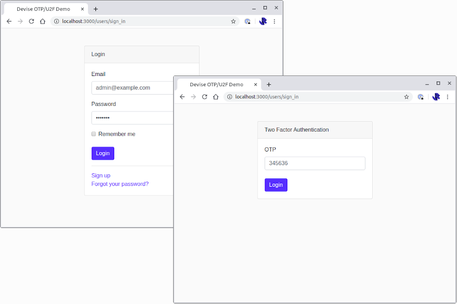

# Devise OTP 2FA as Second Login Step Example

This is an example project that demonstrates how to implement OTP two-factor authentication in devise so that the user
is asked for their OTP code as a second login step.

A step by step guide is available here: [Implementing OTP two-factor authentication as a second login step with Rails and Devise](https://www.jamesridgway.co.uk/implementing-a-two-step-otp-u2f-login-workflow-with-rails-and-devise/)

## Using this example

You can run this example by following the steps below.

1. Run yarn

       yarn install

2. Run bundler

       bundle install

3. Setup the database

       rails db:reset
       rails db:migrate db:seed

4. Visit [http://localhost:3000/])(http://localhost:3000/). Default credentials are:

       Username: admin@example.com
       Password: letmein
